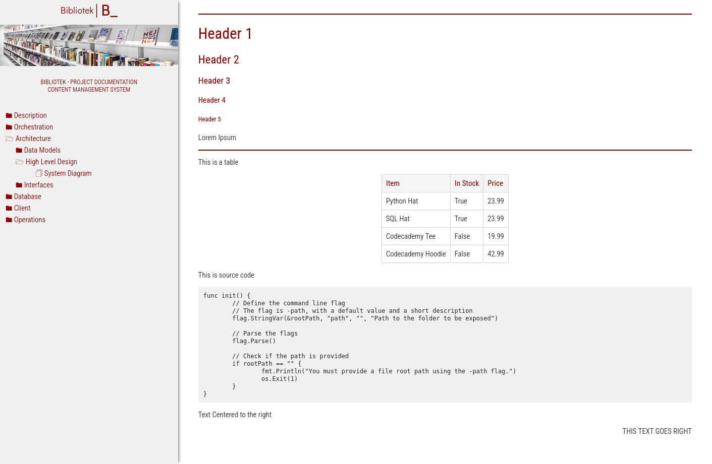

## Bibliotek README.md

### Overview

Bibliotek is a self-contained, lightweight CMS written in Go, HTML, CSS and Javascript. It's uniquely crafted for small teams and startups looking for a zero-maintenance solution to manage and serve their technical documentation. With a focus on simplicity and ease of use, Bibliotek stands out in a landscape dominated by PHP-based CMSs. 



### Motivation

The primary motivation behind Bibliotek is to address the common challenges posed by traditional CMSs — their dependency on specific PHP versions and web server configurations. Bibliotek is a true standalone system that eliminates such dependencies, offering a streamlined and efficient way to manage content. Bibliotek is therefore not a mainstream solution and aims to cover a specific need.

### Philosophy

The name "Bibliotek," meaning "Library" in Danish, reflects the CMS's philosophy. It embodies the minimalistic and cozy ("hygge") experience, bringing this essence to the realm of project documentation.

### Intended Audience

Bibliotek is ideal for autonomous teams and startups that require a hassle-free markdown server for their technical documentation. Its minimal feature set focuses on delivering content efficiently without the complexities of user authentication/authorization (which if required should be managed via a reverse proxy).

### Key Features

With less than 300 lines of code in the backend (commentaries included), Bibliotek is astonishing streamlined. It is easy to understand, read and expand, and it is aimed to those teams looking for a zero-maintenance internal service.

- Flat-File Based: Bibliotek operates entirely on markdown files, ensuring simplicity and portability.
- Sorting Mechanism: Files and folders can be prefixed (e.g., 000_) to control their appearance order. This prefix is not visible in the frontend.
- No Database: Eliminates the need for database management and configuration.
- No Configuration Files: Offers a straightforward setup without the hassle of configuration files.
- No Web Server Requirements: Can run independently without a dedicated web server.
- Single Parameter Setup: Requires only one parameter (-path) to specify the content and static files' location.
- Content & Static Directories: Organized content in content and static folders for clarity and ease of management.
- Customizable HTML & CSS: Located under the static folder, allowing for easy customization to fit branding needs.

### When to use it, when not to use

Users requiring more features or looking to store massive amounts of documents shall likely use another CMS. Bibliotek has been conceived to be used as stand alone project or startup repository. The main goal is to have a zero overhead CMS for documentation, and as such, lacks advanced features.
 
### License Note

While Bibliotek is distributed under the MIT license, it is important to note that any associated photos might be copyrighted and are therefore not included under this license.

### Requirements

- go
- gomarkdown package installed

### Compilation

```
go get github.com/gomarkdown/markdown
make
```

### Installation

Copy static and content folder to your preferred folder.
Deploy your folder structure and markdown files under content subfolder.


### Running

```
./bibliotek -path .
./bibliotek -path "/my/path"
```

### Development Status

Bibliotek is currently in Alpha but it is fully functional. Report any bugs or suggestions through Git.
A sample structure will be added to allow users better understand how to deploy files (although it is as simple as deploying a folder structure and markdown files that end in .md). Files and folders are sorted alphabetically, a prefix 000_ can be used before the file or folder name to help the sortening, that prefix -if present- will not appear in the front end.
An inline markdown editor is the top missing feature being considered to be added, as of now, markdown files need to be written externally and uploaded to the server.
